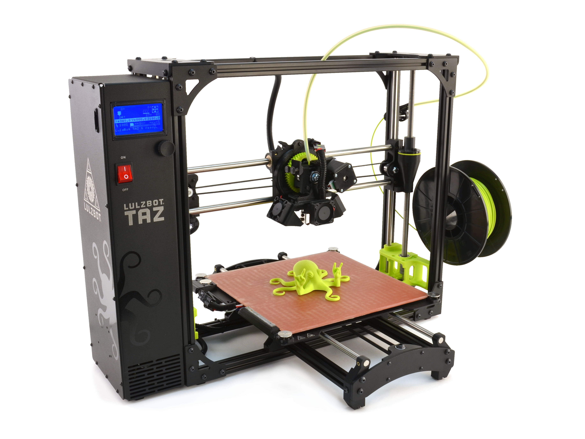
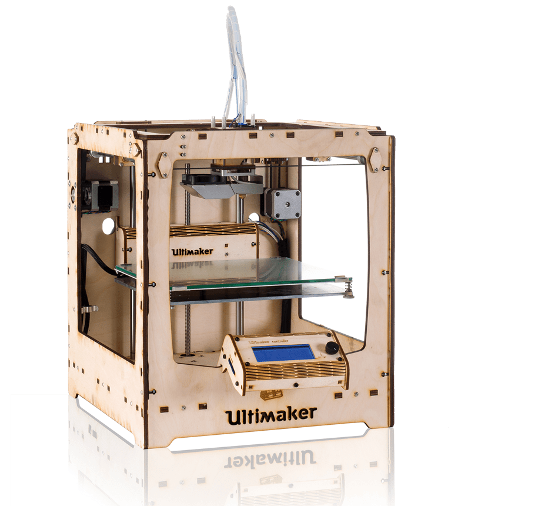

# Tammerforce 3D Printing
Collection of Tammerforce 3D printing README:s and guides

## Printers Overview

### LulzBot TAZ 6

The documentation for LulzBot TAZ 6 usage is found [here](/lulzbot-taz-6/README.md).

#### Links

[Manufacturers page](https://www.lulzbot.com/store/printers/lulzbot-taz-6)

[Users's manual](http://download.lulzbot.com/TAZ/6.02/documentation/manual/9780989378482_interior_r6.02.pdf)

#### Printer head: TAZ 6 Single Extruder v2.1

- Compatible with non-flexible filament with an extrusion temperature under 300°C

#### Printer head: TAZ 6 Dual Extruder v3

- 2x 0.50mm nozzle
- Can print two kinds of materials on the same print
- No material limitations

### Ultimaker Original+

[Manufacturers page](https://ultimaker.com/en/products/ultimaker-original)

[User's manual & assembly instructions](https://ultimaker.com/en/resources/20978-umoplus-assembly)
